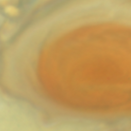
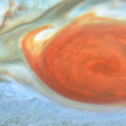
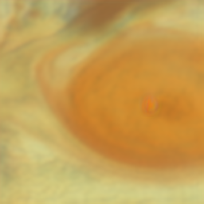
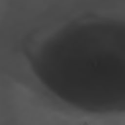
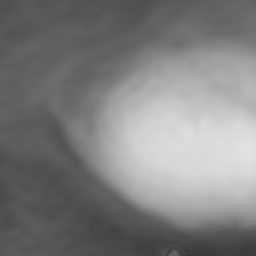

# Photometric Calibration of JunoCam images from Hubble Space Telescope (HST) observations using Unpaired Neural Schrödinger Bridge (UNSB)
<p align="center">
  
  
  
  
  
</p>
From left to right: HST reference, JunoCam image, Calibrated JunoCam RGB, UV, and Methane images.


The code is heavily based on the original source code of [UNSB](https://github.com/cyclomon/unsb). Follow instructions in that repo on how to install dependencies.


## Pretrained Models and Dataset 
We provide all models we have already trained to produce the calibrated JunoCam dataset, along with example calibrated mosaics and the training dataset [here](https://zenodo.org/uploads/16429481).
Separate models are trained for calibrating the RGB values of JunoCam and for predicting the UV and Methane (M) channels. The process is as follows: 
1. First train the RGB calibration model where domain A is JunoCam and domain B is HST. 
2. Run testing using the model to create a set of calibrated (fake) JunoCam RGB images.
3. Reformulate the image-to-image translation task using the calibrated (fake) images as domain A and HST as domain B.
4. Rerun training to translate the calibrated images to the UV, M channels.

More details on how to follow this process are provided below in the how to train your own models section.

We organized the JunoCam PJs and HST Cycles based on temporal proximity and trained the following models for both RGB and UV,M:
- C25_PJ15: PJs (13 15 16 17), Cycle 25
- C26_PJ18: PJs (16 17 18 19 20), Cycle 26
- C26_PJ20: PJs (18 19 20 21 22), Cycle 26
- C27_PJ27: PJs (25 26 27 28 29), Cycle 27
- C28_PJ33: PJs (31 32 33 34 35), Cycle 28

**Note:** For UVM prediction of the GRS we trained a separate model (GRS_images) using images from PJs 17 18 21 27 31 that contain the GRS (see hst_GRS_images.txt, junocam_GRS_images.txt in our dataset folder).


The calibrated dataset (i.e., final product and output of the trained models) can be found on PDS [here](...).
If interested in replicating these models, then download our training dataset, place it under datasets/ and use the commands in **run_train.sh**.
Similarly, use the commands in **run_test.sh** to recreate the calibrated segments that can be found on PDS.


## Create own dataset and train your own models
Follow the instructions in our [JunoCam Calibration utils repo](...) to generate your own training dataset (custom_dataset) from flattened JunoCam and HST maps and place it under datasets/.
To train the RGB calibration model for specific PJs, Cycles, and zones:
```
python train.py --dataroot ./datasets/custom_dataset --name junocam_calibration_custom_model --mode sb --lambda_SB 1.0 --lambda_NCE 1.0 --dataset_mode unaligned_npy --phase train --input_nc 3 --output_nc 3 --use_zone_pairs --fix_time_bug --PJs 18 19 20 --cycles 26 27 --zones SEB
```
If no argument is given for --PJs, --cycles, and --zones, the model is trained on all data. The --use_zone_pairs forces the model to pair training examples from the same zone. The --fix_time_bug addresses a bug in the UNSB code where the timing embedding was not incorporated properly.

Then generate the calibrated images:
```
python test.py --dataroot ./datasets/junocam_calibration_custom_dataset --name junocam_calibration_custom_model --out_name junocam_calibration_custom_model_test --checkpoints_dir ./checkpoints --mode sb --eval --phase test --dataset_mode unaligned_npy --input_nc 3 --output_nc 3 --epoch latest --use_zone_pairs --fix_time_bug
```
Next, we need to train the model to predict the UV and Methane channels.
Use the calibrated npy files under the results/junocam_calibration_custom_model_test and define them as domain A in a new dataset under a calibrated_npy folder. Domain B is still HST (use the same trainB folder from RGB training):
```
python train.py --dataroot ./datasets/calibrated_npy --name junocam_calibration_UVM_custom_model --mode sb --lambda_SB 1.0 --lambda_NCE 1.0 --dataset_mode unaligned_npy --phase train --input_nc 2 --output_nc 2 --use_zone_pairs --fix_time_bug --PJs 18 19 20 --cycles 26 27 --zones SEB
```
Finally, to generate the UV and Methane channel npy files:
```
python test.py --dataroot ./datasets/calibrated_npy --name junocam_calibration_UVM_custom_model --checkpoints_dir ./checkpoints --out_name junocam_calibration_UVM_custom_model_test --mode sb --eval --phase test --dataset_mode unaligned_npy --input_nc 2 --output_nc 2 --epoch latest --use_zone_pairs --fix_time_bug --PJs 20 --cycles 26
```


## References
Since we borrow heavily from UNSB, please consider citing the original paper if you find our work useful:
```bib
@InProceedings{
  kim2023unsb,
  title={Unpaired Image-to-Image Translation via Neural Schrödinger Bridge},
  author={Beomsu Kim and Gihyun Kwon and Kwanyoung Kim and Jong Chul Ye},
  booktitle={ICLR},
  year={2024}
}
```

## Acknowledgements
This work was funded by NASA ROSES New Frontiers Data Analysis Program (NFDAP) and conducted for the project "Disentangling Jupiter’s Complex Atmospheric Processes Through the Application of Machine Learning Methods to JunoCam Data" (80NM0018F0612).